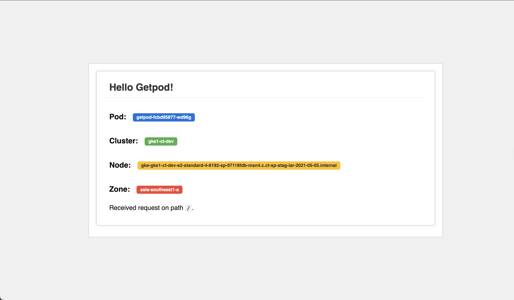

# getpod

Simple web application that displays a simple message and information about Pod, GKE Cluster, GKE Node and Zone serving the request.

The application is also published as a container image: 
```
docker pull ghcr.io/duyhenryer/getpod:main
```

## Deployment

See `deploy.yaml` for simple deployment example.

The application exposes health-check `/healthz` endpoint.



## Configuration

Serving port (defaults to `8080`) can be parametrised using the `-listen-addr` flag or `K8S_DEMO_APP_LISTEN_ADDR` environment variable.

Displayed message can be parametrised by setting the `K8S_DEMO_APP_MESSAGE` variable.
